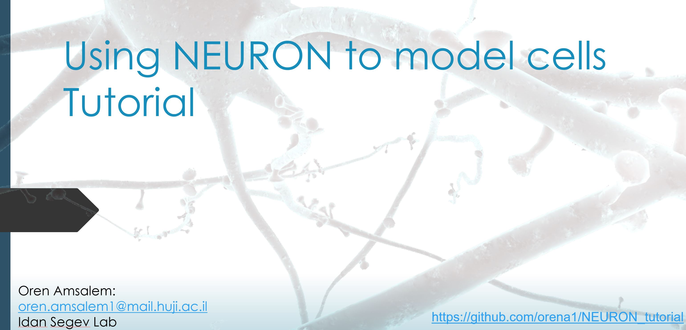

## This tutorial will help you understand how to use [The NEURON simulation environment](https://neuron.yale.edu/neuron/) 

### Instructions

In order to user this tutorial you need to install NEURON (read how to install NEURON in How_to_Install_NEURON.txt) after that you can decide to use jupyter notebook or Python scripts.

In anyway you need to complie to mods, for exmaple if you decide to use the Jupyter_notebooks (Linux):
1. open Terminal
2. go to Jupyter_notebooks directory
3. Type: nrnivmodl mods

After completing the installations open the **NEURON_tutorial.pptx** file
